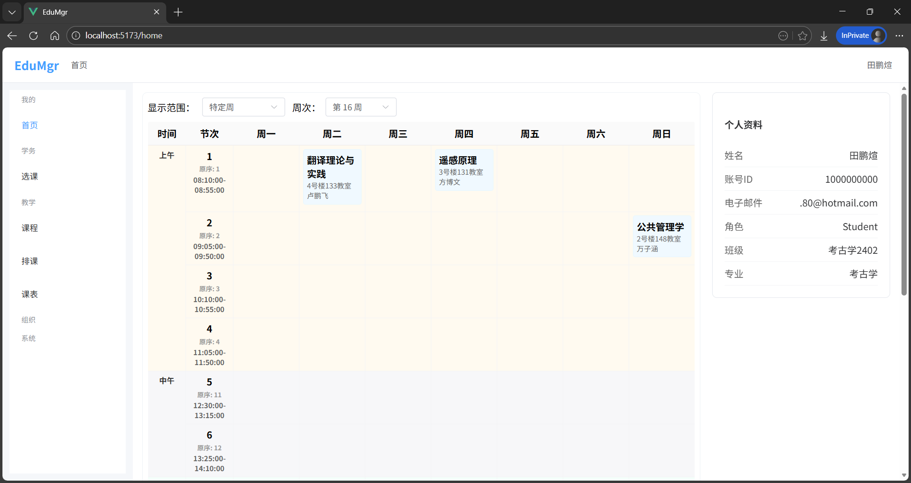
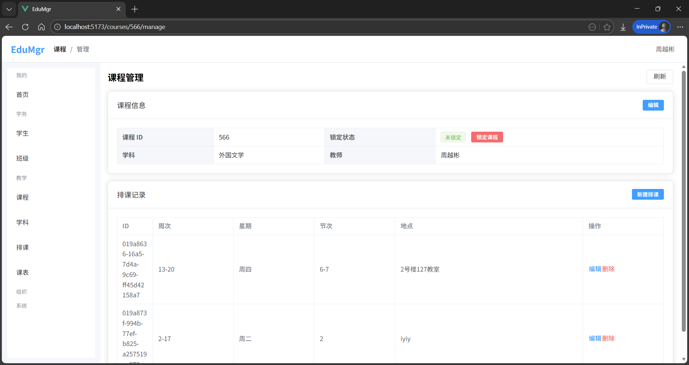

基于.NET和Vue的教务管理系统的设计和实现
===
[OpenAPI 规范文件](./assets/swagger.json)

| 子项目                                                                                              | 说明             | 可启动  | 可部署  |
|--------------------------------------------------------------------------------------------------|----------------|:----:|:----:|
| [Fachep.EduMgr.AppHost][AppHost]                                                                 | Aspire 主机      | :ok: |      |
| [Fachep.EduMgr.Background][Background]                                                           | 后台任务主机         | :ok: | :ok: |
| [Fachep.EduMgr.Database][Database]                                                               | 数据库上下文和迁移      |      |      |
| [Fachep.EduMgr.Entities][Entities]                                                               | 数据库实体（表）定义     |      |      |
| [Fachep.EduMgr.Frontend][Frontend]                                                               | 前端             | :ok: | :ok: |
| [Fachep.EduMgr.Infrastructure.Common][Infrastructure.Common]                                     | 公共组件           |      |      |
| [Fachep.EduMgr.Infrastructure.Data][Infrastructure.Data]                                         | 仓储层抽象          |      |      |
| [Fachep.EduMgr.Infrastructure.Data.EntityFrameworkCore][Infrastructure.Data.EntityFrameworkCore] | 仓储层 EFCore 实现  |      |      |
| [Fachep.EduMgr.ServiceDefaults][ServiceDefaults]                                                 | Aspire 默认服务    |      |      |
| [Fachep.EduMgr.WebAPI][WebAPI]                                                                   | 后端 WebAPI 框架   |      |      |
| [Fachep.EduMgr.WebAPI.Business][WebAPI.Business]                                                 | 后端 WebAPI 业务实现 |      |      |
| [Fachep.EduMgr.WebHost][WebHost]                                                                 | 后端主机           | :ok: | :ok: |

[AppHost]: ./src/Fachep.EduMgr.AppHost
[Background]: ./src/Fachep.EduMgr.Background
[Database]: ./src/Fachep.EduMgr.Database
[Entities]: ./src/Fachep.EduMgr.Entities
[Frontend]: ./src/Fachep.EduMgr.Frontend
[Infrastructure.Common]: ./src/Fachep.EduMgr.Infrastructure.Common
[Infrastructure.Data]: ./src/Fachep.EduMgr.Infrastructure.Data
[Infrastructure.Data.EntityFrameworkCore]: ./src/Fachep.EduMgr.Infrastructure.Data.EntityFrameworkCore
[ServiceDefaults]: ./src/Fachep.EduMgr.ServiceDefaults
[WebAPI]: ./src/Fachep.EduMgr.WebAPI
[WebAPI.Business]: ./src/Fachep.EduMgr.WebAPI.Business
[WebHost]: ./src/Fachep.EduMgr.WebHost

